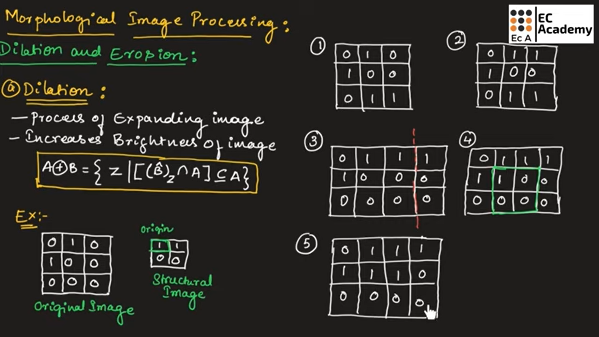
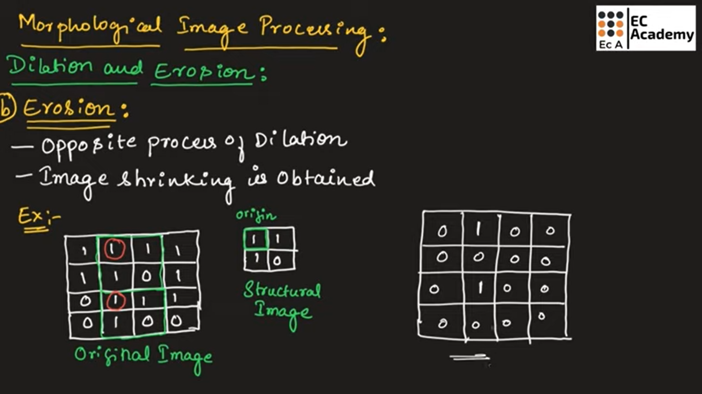
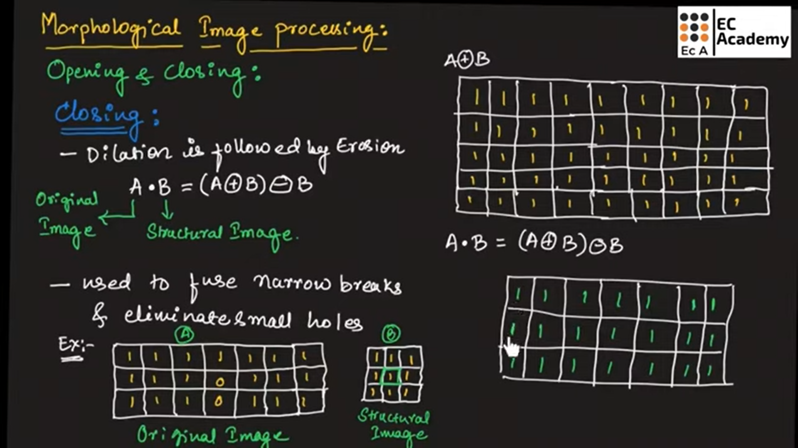
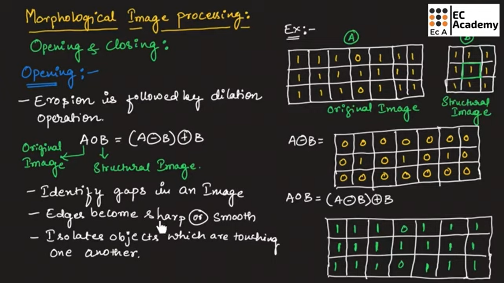
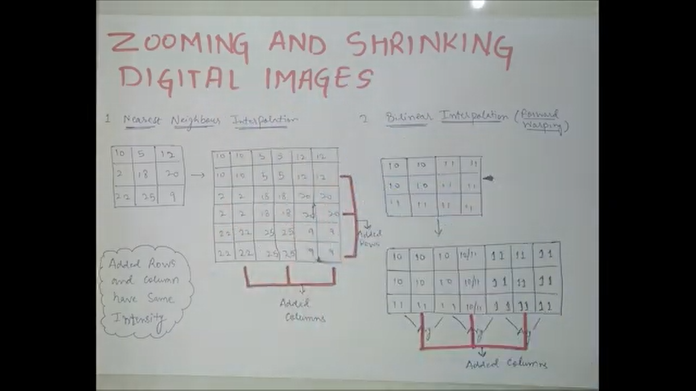

# Unit 1

## What is Computer vision and image processing?

## Computer Vision and Image Processing

## Introduction

**Computer Vision** and **Image Processing** are two closely related fields of study in computer science and engineering. Both deal with images and videos, but they differ in objectives and approaches.

---

## Computer Vision

- **Definition**:  
  Computer vision is a field of artificial intelligence that enables computers and systems to derive meaningful information from digital images, videos, and other visual inputs and to make decisions or recommendations based on that information.

- **Objective**:  
  The main objective of computer vision is to simulate human vision by understanding and interpreting visual data.

- **Key Functions**:

  - Object detection
  - Face recognition
  - Scene reconstruction
  - Motion analysis
  - Image classification

- **Examples**:
  - Self-driving cars recognizing objects on the road
  - Face unlock systems in smartphones
  - Medical image analysis like tumor detection

---

## Image Processing

- **Definition**:  
  Image processing refers to performing operations on an image to enhance it or extract useful information. It is a type of signal processing where the input is an image and the output can be an improved image or characteristics/features extracted from the image.

- **Objective**:  
  The primary objective of image processing is to improve the visual appearance of an image or to perform some form of image analysis.

- **Types of Image Processing**:

  - **Analog image processing**: Involves manipulation of hard copies like photographs.
  - **Digital image processing**: Involves manipulation of digital images using computers.

- **Common Techniques**:

  - Image enhancement (e.g., contrast adjustment)
  - Noise reduction
  - Image segmentation
  - Edge detection
  - Morphological operations

- **Examples**:
  - Applying filters to images on mobile apps
  - Enhancing satellite images
  - Denoising medical images like MRI scans

---

## Differences Between Computer Vision and Image Processing

| Aspect  |                      Computer Vision                       |                Image Processing                 |
| :-----: | :--------------------------------------------------------: | :---------------------------------------------: |
| Purpose |     Understand and interpret images to make decisions      | Improve image quality or extract basic features |
|  Scope  | High-level tasks (object recognition, scene understanding) |    Low-level tasks (filtering, enhancement)     |
| Output  |       Semantic understanding (what is in the image)        |          Processed or enhanced images           |
| Example |          Self-driving car recognizing a stop sign          |      Sharpening an image to see it clearly      |

---

## Conclusion

Computer Vision and Image Processing are fundamental areas in modern technology applications. While image processing deals with basic operations on images, computer vision goes a step further by enabling machines to interpret and make decisions based on visual data, mimicking human intelligence.

---

## Q.1 Explain the concepts of computer vision does it require in image processing.

## Concepts of Computer Vision and Its Relation with Image Processing

## Introduction

Computer vision is a multidisciplinary field that focuses on enabling machines to interpret and understand visual information from the real world. It involves acquiring, processing, analyzing, and understanding digital images to produce numerical or symbolic information.

Image processing plays a crucial foundational role in computer vision by preparing and enhancing images for higher-level interpretation tasks.

---

## Concepts of Computer Vision

- **Image Acquisition**:  
  Capturing an image using cameras, scanners, or sensors. It is the first step where the real-world scene is converted into a digital image.

- **Preprocessing**:  
  Basic image enhancement techniques like noise removal, contrast enhancement, and filtering to improve the quality of the image before analysis.

- **Feature Extraction**:  
  Identifying important features such as edges, corners, textures, or shapes within an image that can help in recognizing patterns.

- **Object Detection and Recognition**:  
  Locating and identifying objects within an image. For example, recognizing a car, pedestrian, or traffic sign in a road scene.

- **Image Segmentation**:  
  Dividing an image into meaningful regions to simplify the analysis. For instance, separating an object from the background.

- **3D Scene Reconstruction**:  
  Building three-dimensional models from two-dimensional images for a better understanding of spatial relationships.

- **Motion Analysis**:  
  Tracking and analyzing the movement of objects across a series of images or video frames.

- **Image Understanding**:  
  Making sense of the visual data by labeling and interpreting the scenes, objects, and activities.

---

## Does Computer Vision Require Image Processing?

**Yes, computer vision heavily relies on image processing.**  
Here’s why:

- Image processing provides the necessary tools to enhance and manipulate images, making them suitable for higher-level vision tasks.
- Preprocessing steps such as denoising, contrast adjustment, and sharpening are essential for accurate feature extraction and object recognition.
- Without image processing, raw images may contain too much noise or irrelevant information, making it difficult for computer vision algorithms to perform correctly.
- Image processing acts as the bridge between raw image acquisition and complex vision tasks like recognition and interpretation.

**Thus, image processing is a fundamental requirement for successful computer vision applications.**

---

## Conclusion

Computer vision aims to enable machines to "see" and interpret the world like humans. It involves several concepts, such as feature extraction, segmentation, and object recognition. Image processing is an integral part of computer vision, as it provides the necessary enhancement and transformation techniques required for accurate analysis and understanding of visual data.

---

## Q.2 What is digital image. What do you mean by image sampling and quantization?

## Digital Image, Image Sampling and Quantization

## What is a Digital Image?

- **Definition**:  
  A digital image is a two-dimensional array of numbers (pixels), where each number represents the intensity (brightness) or color information of a specific point in the image.

- **Explanation**:  
  In a digital image:

  - The image is divided into a finite number of small elements called **pixels**.
  - Each pixel holds a value that describes the brightness (for grayscale images) or color (for colored images) at that specific location.
  - Digital images are usually represented in matrix form where rows and columns correspond to pixel locations.

- **Example**:  
  A 5×5 grayscale digital image might be represented as:

  | 10  | 50  | 80  | 60  | 20  |
  | --- | --- | --- | --- | --- |
  | 20  | 70  | 90  | 40  | 30  |
  | 30  | 80  | 100 | 50  | 40  |
  | 40  | 90  | 110 | 60  | 50  |
  | 50  | 100 | 120 | 70  | 60  |

- **Applications**:
  - Photography
  - Medical Imaging (MRI, CT scans)
  - Satellite Imaging
  - Surveillance Systems

---

## Image Sampling and Quantization

### Image Sampling

- **Definition**:  
  Sampling refers to the process of selecting a finite number of points from a continuous image.

- **Explanation**:

  - In real-world, images are continuous in nature (analog).
  - Sampling involves converting a continuous image into a discrete image by selecting specific points (pixels) at regular intervals.
  - Higher sampling rate → better representation of the original image.
  - Lower sampling rate → loss of information and possible distortion.

- **Example**:  
  If you sample an image at very few points, the image looks pixelated and details are lost.

### Image Quantization

- **Definition**:  
  Quantization refers to the process of assigning a finite number of intensity levels to the sampled pixels.

- **Explanation**:

  - After sampling, each pixel’s continuous intensity value must be mapped to a discrete level.
  - Quantization reduces infinite possible values into a limited set.
  - Higher quantization levels → smoother image with finer details.
  - Lower quantization levels → image appears blocky or posterized.

- **Example**:
  - 8-bit quantization → 2^8 = 256 intensity levels.
  - 4-bit quantization → 2^4 = 16 intensity levels.

---

## Diagram


## Summary

|         Aspect         |                     Sampling                      |                      Quantization                      |
| :--------------------: | :-----------------------------------------------: | :----------------------------------------------------: |
|       Definition       | Selecting discrete points from a continuous image | Mapping continuous intensity values to discrete levels |
|        Purpose         |              Spatial discretization               |                Intensity discretization                |
| Effect of Higher Value |            More pixels, finer details             |            More gray levels, smoother image            |
| Effect of Lower Value  |            Pixelation, loss of detail             |             Blockiness, loss of smoothness             |

---

## Conclusion

A digital image is a discrete representation of a visual object composed of pixels.  
**Sampling** converts continuous images into discrete spatial points, while **quantization** maps their intensity values into finite levels. Both steps are essential for converting real-world analog images into digital form suitable for computer storage, processing, and display.

---

## Q.3 What are the different types of computer vision model. Explain in detail.?

## Different Types of Computer Vision Models

## Introduction

Computer vision models are designed to interpret and analyze visual information.  
Different types of models are built based on the specific tasks they need to perform, such as classification, detection, segmentation, and generation.

---

## Types of Computer Vision Models

### 1. Image Classification Models

- **Definition**:  
  These models predict the category or class of an entire image.

- **Explanation**:

  - Input: A single image.
  - Output: A label (class) indicating what object is present in the image.
  - It answers the question: "What is in the image?"

- **Examples**:

  - Identifying if an image contains a cat or dog.
  - Medical imaging — classifying tumors as benign or malignant.

- **Popular Architectures**:
  - AlexNet
  - VGGNet
  - ResNet

---

### 2. Object Detection Models

- **Definition**:  
  These models detect and localize multiple objects within an image.

- **Explanation**:

  - Input: A single image.
  - Output: Class labels and bounding boxes around objects.
  - It answers: "What objects are in the image and where are they located?"

- **Examples**:

  - Detecting pedestrians in self-driving cars.
  - Surveillance cameras identifying intruders.

- **Popular Architectures**:
  - YOLO (You Only Look Once)
  - SSD (Single Shot MultiBox Detector)
  - Faster R-CNN

---

### 3. Image Segmentation Models

- **Definition**:  
  These models classify each pixel of an image into a category.

- **Explanation**:

  - Input: A single image.
  - Output: A segmented image where each pixel belongs to a specific class.
  - Two Types:
    - **Semantic Segmentation**: Labels each pixel with a class (no distinction between instances).
    - **Instance Segmentation**: Labels each object instance separately.

- **Examples**:

  - Separating roads, pedestrians, and vehicles in autonomous driving.
  - Medical imaging — highlighting regions of interest in MRI scans.

- **Popular Architectures**:
  - U-Net
  - Mask R-CNN
  - DeepLab

---

### 4. Image Generation Models

- **Definition**:  
  These models generate new images from existing data.

- **Explanation**:
  - Used for tasks like image enhancement, style transfer, or generating realistic fake images.
- **Examples**:

  - Creating artistic images using neural style transfer.
  - Deepfake generation.

- **Popular Architectures**:
  - GANs (Generative Adversarial Networks)
  - Variational Autoencoders (VAEs)

---

### 5. Pose Estimation Models

- **Definition**:  
  These models estimate the position and orientation of objects or humans in an image.

- **Explanation**:

  - Predicts key points (like joints in a human body) in images.

- **Examples**:

  - Fitness apps analyzing body posture.
  - Motion capture in animation and gaming.

- **Popular Architectures**:
  - OpenPose
  - PoseNet

---

## Summary Table

|    Type of Model     |           Purpose            | Example Architecture |
| :------------------: | :--------------------------: | :------------------: |
| Image Classification |    Classify entire image     |    ResNet, VGGNet    |
|   Object Detection   |  Detect objects + locations  |  YOLO, Faster R-CNN  |
|  Image Segmentation  |     Classify each pixel      |  U-Net, Mask R-CNN   |
|   Image Generation   |      Create new images       |      GANs, VAEs      |
|   Pose Estimation    | Detect body/object keypoints |  OpenPose, PoseNet   |

---

## Conclusion

Computer vision models are specialized for different tasks ranging from basic classification to complex image generation and understanding.  
Each type of model plays a crucial role in real-world applications like autonomous driving, healthcare, entertainment, and security. Choosing the correct model depends on the specific problem and desired output.

---

## Q.4 Discuss in detail about various types of image filtering technique.

## Various Types of Image Filtering Techniques

## Introduction

Image filtering is a technique used to enhance or modify images by emphasizing certain features or removing unwanted distortions such as noise.  
Filtering techniques are mainly classified into **linear** and **non-linear** filtering methods.

---

## Types of Image Filtering Techniques

### 1. Linear Filtering Techniques

- **Definition**:  
  Linear filtering uses a linear combination of nearby pixel values to compute a new value for a pixel.

- **Explanation**:

  - Involves convolution of the image with a filter (kernel or mask).
  - The output is a weighted sum of neighborhood pixels.

- **Common Linear Filters**:

  #### a. Low Pass Filter (Smoothing)

  - **Purpose**: Removes noise and reduces sharp transitions in the image.
  - **Example**: Mean Filter (Averaging Filter).
  - **Working**: Replaces each pixel with the average of its neighbors.

  #### b. High Pass Filter (Sharpening)

  - **Purpose**: Highlights edges and fine details in an image.
  - **Example**: Laplacian Filter.
  - **Working**: Enhances regions where intensity changes rapidly.

- **Applications**:
  - Noise reduction (Low Pass)
  - Edge detection (High Pass)

---

### 2. Non-Linear Filtering Techniques

- **Definition**:  
  Non-linear filters do not use a simple weighted sum of neighboring pixels; they apply non-linear operations.

- **Explanation**:

  - More effective in preserving edges while removing noise.
  - Do not obey the principle of superposition.

- **Common Non-Linear Filters**:

  #### a. Median Filter

  - **Purpose**: Removes "salt and pepper" noise.
  - **Working**: Replaces each pixel value with the median value of neighboring pixels.
  - **Advantages**: Preserves edges while removing noise.

  #### b. Max and Min Filters

  - **Max Filter**: Replaces pixel with maximum value from neighborhood (brightens image).
  - **Min Filter**: Replaces pixel with minimum value from neighborhood (darkens image).

- **Applications**:
  - Noise removal
  - Image enhancement

---

### 3. Adaptive Filtering Techniques

- **Definition**:  
  Adaptive filters change their behavior based on local image characteristics.

- **Explanation**:

  - The filter parameters (like kernel size) are adjusted dynamically.
  - More effective for non-stationary noise.

- **Example**:

  - Adaptive Median Filter
  - Adaptive Wiener Filter

- **Applications**:
  - Removing non-uniform noise
  - Medical image enhancement

---

## Summary Table

|    Filter Type    |                Purpose                 |     Example Filters     |          Applications           |
| :---------------: | :------------------------------------: | :---------------------: | :-----------------------------: |
|   Linear Filter   |        Smoothing or Sharpening         |     Mean, Laplacian     | Noise reduction, Edge detection |
| Non-Linear Filter | Noise reduction while preserving edges |    Median, Max, Min     |   Salt & pepper noise removal   |
|  Adaptive Filter  |         Dynamic noise removal          | Adaptive Median, Wiener |    Non-uniform noise removal    |

---

## Conclusion

Image filtering is an essential step in image processing for noise removal, feature enhancement, and image smoothing.  
Choosing the appropriate filtering technique depends on the nature of the noise, desired output, and application requirements.  
Linear filters are simple and fast but may blur edges, while non-linear and adaptive filters provide better edge preservation and noise handling.

---

## Q.5 Describe various elements of digital image processing system.

## Various Elements of Digital Image Processing System

## Introduction

A **digital image processing system** involves a set of processes and components that work together to manipulate and enhance digital images. It includes the acquisition, processing, and output of images.  
The system generally works by converting analog images into digital form and then applying various algorithms to extract, enhance, or modify image data.

---

## Elements of a Digital Image Processing System

### 1. **Image Acquisition**

- **Definition**:  
  Image acquisition is the process of capturing an image from a real-world scene using imaging devices like cameras, scanners, or sensors.

- **Explanation**:
  - Involves transforming the scene into a digital format that the system can process.
  - Sensors capture the intensity values of the scene and convert them into digital signals.
- **Components Involved**:

  - **Camera**: Captures the image.
  - **Scanner**: Converts physical documents/photos into digital format.
  - **Sensor**: Measures light intensity for capturing images.

- **Applications**:
  - Capturing real-time images in medical imaging, robotics, surveillance.

---

### 2. **Preprocessing**

- **Definition**:  
  Preprocessing refers to the initial steps involved in preparing the image for further analysis.

- **Explanation**:

  - Techniques like **noise removal**, **image enhancement**, and **contrast adjustment** are applied to make the image ready for analysis.
  - Preprocessing ensures that noise or distortions do not interfere with the main processing tasks.

- **Common Techniques**:

  - **Filtering** (Smoothing, Sharpening)
  - **Histogram Equalization**
  - **Edge Enhancement**

- **Applications**:
  - Image enhancement in medical imaging (e.g., MRI scans).
  - Noise removal in satellite images.

---

### 3. **Image Segmentation**

- **Definition**:  
  Image segmentation involves partitioning an image into meaningful regions or segments, making it easier to analyze specific objects.

- **Explanation**:

  - Each segment corresponds to different objects or parts of the image, which can be analyzed independently.
  - Segmentation is crucial for object recognition, tracking, and further analysis.

- **Common Techniques**:

  - **Thresholding**
  - **Edge Detection**
  - **Region Growing**

- **Applications**:
  - Identifying tumors in medical images.
  - Object detection in surveillance footage.

---

### 4. **Feature Extraction**

- **Definition**:  
  Feature extraction is the process of identifying and extracting relevant information (features) from the segmented image.

- **Explanation**:

  - Extracted features could include **edges**, **textures**, **shapes**, or **patterns**.
  - Features help in distinguishing objects or parts of the image based on their characteristics.

- **Common Features**:

  - **Edges**: Points where intensity changes sharply.
  - **Corners**: Points where the edges meet.
  - **Textures**: Patterns in the image.

- **Applications**:
  - Facial recognition.
  - Fingerprint analysis.

---

### 5. **Image Recognition/Classification**

- **Definition**:  
  Image recognition involves classifying the objects in the image based on the extracted features.

- **Explanation**:

  - After feature extraction, the system identifies the image's content by classifying it into a predefined set of categories.
  - Recognition systems might use techniques like machine learning to improve accuracy.

- **Techniques**:

  - **Pattern Matching**
  - **Machine Learning**
  - **Neural Networks**

- **Applications**:
  - Facial recognition in security systems.
  - Identifying objects in autonomous vehicles.

---

### 6. **Post-Processing**

- **Definition**:  
  Post-processing refers to the final stage in the image processing pipeline where the results are refined or enhanced.

- **Explanation**:

  - It may involve displaying the results, applying final adjustments, or preparing the output for specific applications.
  - Post-processing ensures that the processed image is presented in an optimal format.

- **Common Techniques**:

  - **Image Compression**
  - **Image Restoration**
  - **Output Formatting**

- **Applications**:
  - Preparing final processed images for medical diagnosis.
  - Compression for faster transmission of images.

---

## Summary Table

|      Element       |                 Purpose                  |              Examples              |
| :----------------: | :--------------------------------------: | :--------------------------------: |
| Image Acquisition  |       Capturing real-world images        |     Cameras, Sensors, Scanners     |
|   Preprocessing    |      Preparing images for analysis       | Noise removal, Contrast adjustment |
| Image Segmentation |      Dividing an image into regions      |    Thresholding, Region growing    |
| Feature Extraction |   Extracting important image features    |      Edges, Shapes, Textures       |
| Image Recognition  |  Classifying the image into categories   | Pattern matching, Machine learning |
|  Post-Processing   | Refining and formatting the final output |      Compression, Restoration      |

---

## Conclusion

The digital image processing system is a comprehensive framework that involves multiple stages, from acquisition to output. Each element plays a crucial role in enhancing the image, extracting useful information, and presenting the results for further analysis or action. Understanding each element is key to designing and optimizing image processing systems for various applications such as medical imaging, surveillance, and automation.

---

## Q.6 Explain following operations-

- Diletion
- Erosion
- Closing

## Explanation of Operations: Dilation, Erosion, and Closing

## Introduction

Dilation, Erosion, and Closing are fundamental morphological operations used in **image processing** for manipulating the structure or shape of objects within an image. These operations are primarily applied to binary images (black and white images) and are often used to remove noise, fill gaps, and enhance specific features of the image.

---

## 1. **Dilation**

- **Definition**:  
  Dilation is a morphological operation that increases the white region in a binary image. It "expands" the boundaries of objects in the image.

- **Explanation**:

  - In dilation, the **structuring element** (a small matrix, usually a square or circle) slides over the image, and for each pixel in the image, the output pixel is set to the maximum value of the pixel under the structuring element.
  - Effectively, dilation increases the size of bright regions and can connect nearby objects or fill small gaps between them.

- **Process**:

  - **Input**: A binary image.
  - **Operation**: The structuring element is placed on each pixel, and the pixel value is set to 1 if any pixel under the structuring element is 1. Otherwise, the pixel is set to 0.

- **Example**:

  - If you have a small object in a binary image, dilation will make the object bigger and may fill small holes.

- **Applications**:

  - **Filling small holes** in an object.
  - **Bridging gaps** between objects.
  - **Expanding boundaries** of objects.

  

---

## 2. **Erosion**

- **Definition**:  
  Erosion is the inverse of dilation. It reduces the size of the bright regions (foreground objects) and shrinks boundaries.

- **Explanation**:

  - In erosion, the structuring element slides over the image, and for each pixel in the image, the output pixel is set to the minimum value of the pixel under the structuring element.
  - Erosion shrinks objects and removes small noise points (like tiny white spots).

- **Process**:

  - **Input**: A binary image.
  - **Operation**: The structuring element is placed on each pixel, and the pixel value is set to 1 only if all the pixels under the structuring element are 1. If any pixel is 0, the result will be 0.

- **Example**:

  - Erosion can shrink a large object in a binary image and remove small isolated noise spots.

- **Applications**:
  - **Removing small noise** from an image.
  - **Shrinking boundaries** of objects.
  - **Separating connected objects** that are too close together.



---

## 3. **Closing**

- **Definition**:  
  Closing is a combination of **dilation followed by erosion**. It is primarily used to close small holes or gaps in the foreground.

- **Explanation**:

  - First, dilation is applied to expand the objects and fill in small gaps or holes.
  - Then, erosion is applied to shrink the image slightly and remove any unwanted thin regions that may have appeared due to dilation.
  - Closing is useful for **removing small black regions** (background areas) that might exist within objects.

- **Process**:

  - **Input**: A binary image.
  - **Operation**: Perform dilation followed by erosion using the same structuring element.

- **Example**:

  - If you have an object with small holes or gaps, closing will help fill those gaps while maintaining the object's overall shape.

- **Applications**:

  - **Filling holes** in objects.
  - **Smoothing contours** of an object.
  - **Connecting nearby objects** that are only separated by small gaps.

  

---

## Summary Table

|  Operation   |                     Purpose                      |                             Effect                              |              Example Use Case               |
| :----------: | :----------------------------------------------: | :-------------------------------------------------------------: | :-----------------------------------------: |
| **Dilation** | Expands bright regions and increases object size |       Expands object boundaries, connects nearby objects        |      Fills small gaps, bridges objects      |
| **Erosion**  |  Shrinks bright regions and reduces object size  |         Shrinks object boundaries, removes small noise          | Removes noise, separates connected objects  |
| **Closing**  |       Fills small holes or gaps in objects       | Combination of dilation and erosion, removes small dark regions | Closes small holes, smooths object contours |

---

## Conclusion

- **Dilation** and **erosion** are basic morphological operations that modify the size and shape of objects in a binary image.
- **Closing** is a useful operation that combines both dilation and erosion to improve the quality of images by closing gaps in objects and smoothing their boundaries.
- These operations are extensively used in tasks like noise removal, object separation, and enhancing image structures in various applications such as medical image analysis, computer vision, and object recognition.

---

## Q.7 With necessary figures, explain the opening and closing operations.

## Explanation of Opening and Closing Operations in Digital Image Processing

## Introduction

**Opening** and **Closing** are advanced morphological operations in image processing that help in noise removal and shape enhancement. Both operations are based on **dilation** and **erosion**, and they are often used to modify the structure of objects in a binary image, especially for tasks like noise removal, contour smoothing, and closing gaps in objects.

---

## 1. **Opening Operation**

- **Definition**:  
  Opening is a morphological operation that involves **erosion followed by dilation**. It is used to **remove small objects** or noise from the foreground (white regions) of a binary image.

- **Explanation**:

  - **Erosion** shrinks the boundaries of the foreground objects, removing small noise or objects that are not part of the main object.
  - **Dilation** follows to restore the size of the objects that remain after erosion, but the smaller structures that were removed during erosion will not be restored.

- **Process**:

  - **Step 1**: Erosion is performed on the image using a structuring element. This operation removes small white regions (noise).
  - **Step 2**: Dilation is then applied to the result of erosion to restore the size of the remaining objects, while not bringing back the small noise regions.

- **Use Cases**:

  - Removing small noise or isolated pixels.
  - Separating connected objects that are slightly touching.

- **Figure**:

  - **Initial Image**:
    - Before applying opening.
  - **After Erosion**:
    - Shrinking small objects and noise removal.
  - **After Dilation**:
    - Restoring the main object’s size, but keeping noise removed.

- **Example**:

```
Initial Image (Input):

   11111
   10001
   10101
   10001
   11111

After Erosion (removes small noise):

   00000
   00001
   00001
   00000
   00000

After Dilation (restores object size):

   00000
   01010
   01010
   01010
   00000
```



---

## 2. **Closing Operation**

- **Definition**:  
  Closing is a morphological operation that involves **dilation followed by erosion**. It is used to **fill small holes** or gaps in the foreground objects and to connect nearby objects.

- **Explanation**:

  - **Dilation** first expands the boundaries of the objects, effectively filling in small gaps and holes in the objects.
  - **Erosion** follows, which shrinks the objects back, but any small gaps or holes filled by dilation are retained.

- **Process**:

  - **Step 1**: Dilation is applied to the image to expand the white regions, filling in any small black holes within the objects.
  - **Step 2**: Erosion is applied to the result of dilation to shrink the objects back to their original size, but now with the small holes or gaps filled.

- **Use Cases**:

  - Closing small holes or gaps inside the foreground objects.
  - Connecting small breaks between nearby objects.

- **Figure**:

  - **Initial Image**:
    - Before applying closing.
  - **After Dilation**:
    - Filling gaps and holes in objects.
  - **After Erosion**:
    - Shrinking back objects while keeping the gaps filled.

- **Example**:

```
Initial Image (Input):

   11111
   10001
   10101
   10001
   11111

After Dilation (fills holes):

   11111
   11111
   11111
   11111
   11111

After Erosion (shrinks back):

   11111
   11101
   11101
   11111
   11111
```


---

## Summary Table

|  Operation  |             Purpose              |                              Effect                              |         Example Use Case          |
| :---------: | :------------------------------: | :--------------------------------------------------------------: | :-------------------------------: |
| **Opening** | Removes small noise and objects  |        Shrinks and removes small structures in the image         | Noise removal, separating objects |
| **Closing** | Fills holes and connects objects | Expands and fills gaps, then shrinks back to remove small breaks | Filling gaps, connecting objects  |

---

## Conclusion

- **Opening** and **Closing** are important morphological operations that help refine and preprocess binary images.
- **Opening** is typically used to remove small objects or noise from an image, while **Closing** is used to fill small gaps and connect broken objects.
- These operations are useful in a variety of image processing tasks such as noise reduction, object separation, and object enhancement in fields like medical imaging, computer vision, and image analysis.

---

## Q.8 Discuss morphological algorithm operations performed on gray Scale Images.

## Morphological Algorithm Operations on Grayscale Images

## Introduction

Morphological operations are a class of image processing techniques that process images based on their shapes. In the case of **grayscale images**, these operations manipulate the intensity (brightness) of the pixels to enhance or extract specific features, such as boundaries, textures, and shapes. Unlike binary images, where the operations work with just two pixel values (0 and 1), grayscale morphological operations take into account the continuous range of pixel intensities.

The most common morphological operations, such as **erosion**, **dilation**, **opening**, and **closing**, can be extended to grayscale images to manipulate the intensity of pixels in a way that can help in tasks such as noise removal, object detection, and edge enhancement.

---

## 1. **Grayscale Dilation**

- **Definition**:  
  Grayscale dilation is a morphological operation that expands the bright regions (foreground) of an image. For each pixel in the image, the output pixel takes the **maximum intensity** from the neighborhood of the pixel under the structuring element.

- **Process**:
  - The structuring element slides over the image.
  - For each pixel in the image, the pixel's new value is set to the maximum intensity value in the neighborhood covered by the structuring element.
- **Effect**:

  - It **increases** the intensity of regions in the image, making bright objects more prominent.
  - Grayscale dilation can be used to enhance features like edges or remove small dark regions within bright objects.

- **Applications**:
  - **Highlighting the brightest regions** in an image.
  - **Expanding** light regions and enhancing bright features.

---

## 2. **Grayscale Erosion**

- **Definition**:  
  Grayscale erosion is a morphological operation that shrinks the bright regions of an image. For each pixel, the output pixel is set to the **minimum intensity** from the neighborhood of the pixel under the structuring element.

- **Process**:

  - The structuring element slides over the image.
  - For each pixel, the new pixel value is set to the minimum value in the neighborhood covered by the structuring element.

- **Effect**:

  - It **reduces** the intensity of regions in the image, making the dark regions more prominent.
  - Grayscale erosion can be used to remove small bright spots or reduce the size of bright features in the image.

- **Applications**:
  - **Shrinking light regions**.
  - **Removing small bright regions** from the image.

---

## 3. **Grayscale Opening**

- **Definition**:  
  Grayscale opening is a combination of **erosion followed by dilation**. It is used to **smooth the contour** of objects, **remove small noise**, and separate objects that are connected by thin lines.

- **Process**:

  - **Step 1**: Erosion is applied to the image, which removes small bright regions and shrinks the larger ones.
  - **Step 2**: Dilation is applied to the result of erosion, which restores the size of the remaining features while keeping the noise or small objects removed.

- **Effect**:

  - It is used to **remove small structures** or noise from the image, smooth object boundaries, and separate objects that are only weakly connected.

- **Applications**:
  - **Noise removal** (specifically small bright spots).
  - **Object separation** in cases of connected objects.

---

## 4. **Grayscale Closing**

- **Definition**:  
  Grayscale closing is a combination of **dilation followed by erosion**. It is used to **close small gaps** or holes in objects and connect nearby structures.

- **Process**:

  - **Step 1**: Dilation is applied, which expands the bright regions, filling any small gaps within the foreground objects.
  - **Step 2**: Erosion is then applied to the result of dilation to restore the original size of the objects while keeping the holes filled.

- **Effect**:

  - It is used to **fill small dark regions** (such as holes inside objects) and **connect nearby structures** in an image.

- **Applications**:
  - **Filling small holes** within objects.
  - **Connecting broken or fragmented objects**.

---

## 5. **Grayscale Top-Hat Transform**

- **Definition**:  
  The **top-hat transform** is the difference between the original image and its **opening**. It is used to highlight small bright features that are smaller than the structuring element.

- **Process**:

  - **Step 1**: Perform an opening operation on the image.
  - **Step 2**: Subtract the opened image from the original image.

- **Effect**:

  - It highlights the small bright features in an image that are smaller than the structuring element.

- **Applications**:
  - **Detecting small bright features** in images.
  - **Isolating small objects** within a larger image.

---

## 6. **Grayscale Bottom-Hat Transform**

- **Definition**:  
  The **bottom-hat transform** is the difference between the **closing** of the image and the original image. It is used to highlight small dark features within the image.

- **Process**:

  - **Step 1**: Perform a closing operation on the image.
  - **Step 2**: Subtract the original image from the closed image.

- **Effect**:

  - It highlights small dark features that are smaller than the structuring element.

- **Applications**:
  - **Detecting small dark features** within an image.
  - **Isolating small dark objects** or gaps.

---

## Summary Table

|        Operation         |                    Description                     |                    Effect                     |                Applications                 |
| :----------------------: | :------------------------------------------------: | :-------------------------------------------: | :-----------------------------------------: |
|  **Grayscale Dilation**  | Expands bright regions by taking maximum intensity |        Increases brightness of regions        | Enhancing bright features, edge enhancement |
|  **Grayscale Erosion**   | Shrinks bright regions by taking minimum intensity |         Reduces brightness of regions         |   Noise removal, shrinking bright objects   |
|  **Grayscale Opening**   |            Erosion followed by dilation            | Removes small objects/noise, smooths contours |      Noise removal, object separation       |
|  **Grayscale Closing**   |            Dilation followed by erosion            |     Fills holes, connects nearby objects      |   Hole filling, connecting broken objects   |
|  **Top-Hat Transform**   |  Difference between the original and the opening   |       Highlights small bright features        |        Detecting small bright spots         |
| **Bottom-Hat Transform** |  Difference between the closing and the original   |        Highlights small dark features         |        Detecting small dark regions         |

---

## Conclusion

- **Grayscale morphological operations** extend the basic operations of dilation, erosion, opening, and closing to handle the continuous range of intensities in grayscale images.
- These operations are highly effective for **image enhancement**, **noise removal**, **object detection**, and **shape analysis** in grayscale images.
- Operations like **Top-Hat** and **Bottom-Hat** are specialized tools to highlight specific features based on the structural characteristics of the image.

---

## Q.9 Explain thinning operation in brief.

## Thinning Operation in Image Processing

## Introduction

Thinning is a morphological operation used to **simplify the shape** of objects in a binary image by reducing the thickness of object boundaries. It is mainly used for **skeletonization**, which involves reducing the thickness of shapes to a single pixel width, preserving the general shape and structure of the object. This operation is primarily used in **binary images**, where pixel values are either **0** (background) or **1** (foreground).

---

## Purpose of Thinning

- The main goal of **thinning** is to reduce the width of foreground objects while preserving their topological structure, such as **connectivity** and **edges**.
- It is commonly used in tasks like:
  - **Skeletonization**: To extract the "skeleton" or "centerline" of an object.
  - **Shape analysis**: For analyzing the shape of the objects in the image, such as characters in handwriting recognition or morphological analysis in medical imaging.

---

## How Thinning Works

- **Step 1**: Thinning is performed by iteratively applying a set of conditions to each pixel of the image.
- **Step 2**: A **structuring element** is used to define the neighborhood of a pixel. The algorithm examines the pixels in the neighborhood of the current pixel and checks for conditions to determine whether to remove the pixel.
- **Step 3**: The process is repeated until no more pixels can be removed.

The most common approach for thinning is **iterative thinning**, where pixels are removed based on local conditions, such as:

- A pixel is deleted if it is part of the boundary and does not affect the connectivity of the remaining pixels.
- The process typically involves several iterations until the desired thinning effect is achieved.

---

## Applications

- **Skeletonization**: Reduces the thickness of objects to a single pixel, useful in character recognition and shape analysis.
- **Object recognition**: Helps to focus on the essential features of the object while removing unnecessary thickness.
- **Medical imaging**: Used for analyzing blood vessels, bones, or any structures that require precise representation.

---

## Example (Illustration)

Imagine an object (represented as a 1 in the image) that needs to be thinned. The original shape might be a thick line, and after several iterations of the thinning operation, it will reduce to a thin line representing the object's skeleton.

- **Before Thinning**:

  ```
  111
  111
  111
  ```

- **After Thinning** (skeletonized):
  ```
  010
  010
  010
  ```

The object is reduced to a single-pixel wide "skeleton," preserving the shape of the original object but with minimized thickness.

---

## Conclusion

- Thinning is a vital morphological operation used to simplify objects in binary images by reducing them to their skeleton form.
- It is particularly useful for applications that require a **minimal representation** of objects, such as **handwriting recognition**, **medical imaging**, and **shape analysis**.

---

## Q.10 What do you mean by Zooming & shrinking of digital images.

## Zooming and Shrinking of Digital Images

## Introduction

Zooming and shrinking are operations used to **resize** digital images by either **increasing** or **decreasing** the image's **dimensions**. These operations are important for image manipulation, enhancement, and display on various devices. The terms are often used to describe **scaling** an image, which involves changing the image's **size** while attempting to maintain its quality.

---

## 1. **Zooming of Digital Images**

### Definition:

Zooming refers to the operation where the **image size is increased**, making the image appear **larger**. It can also be called **upscaling** or **magnification**. This is often used when we want to view more details of an image or when the image needs to be displayed in a larger format.

### Process:

- When an image is zoomed in, the **pixel size increases**, meaning more pixels are used to represent the image in a larger dimension.
- The process typically involves **interpolation** techniques to estimate the new pixel values that lie between the existing pixels.

### Interpolation Methods:

- **Nearest-Neighbor Interpolation**: The simplest form where each pixel is replaced with the nearest pixel value.
- **Bilinear Interpolation**: Uses the four nearest pixels and averages their values to calculate the new pixel value.
- **Bicubic Interpolation**: Considers the 16 nearest pixels and calculates the new pixel value using cubic polynomials, providing smoother results.

### Effect:

- **Zooming in** increases the image's size but may lead to a **loss of clarity** or **pixelation** if the image is enlarged too much, as it introduces new pixels based on estimates rather than original data.

### Applications:

- **Detail analysis**: Zooming into specific areas of an image to examine fine details.
- **Image editing**: Enlarging images for digital manipulation, like photo editing or graphic design.

---

## 2. **Shrinking of Digital Images**

### Definition:

Shrinking refers to the operation where the **image size is decreased**, making the image appear **smaller**. This process is also called **downscaling** or **reduction**. It is typically used when we need to reduce the resolution of an image or prepare an image for displaying on smaller devices.

### Process:

- When an image is shrunk, the **pixel size decreases**, which means that fewer pixels are used to represent the image in a smaller dimension.
- Similar to zooming, **resampling** or **decimation** techniques are used to remove pixels and fit the image into the smaller size.

### Methods:

- **Averaging or Resampling**: For reducing the size, a simple approach is to average the values of neighboring pixels and assign a new pixel value.
- **Gaussian Pyramid**: A technique that generates a series of images with progressively smaller resolutions, useful in applications like image compression and object detection.

### Effect:

- **Shrinking** an image often causes **loss of detail** since pixels are discarded, and a smaller resolution image retains less information than the original.

### Applications:

- **Web usage**: Reducing image sizes for faster loading on websites.
- **Storage**: Shrinking images to save storage space while maintaining an acceptable level of quality.
- **Printing**: Preparing images for print in smaller sizes.

---

## Summary Table

|   Operation   |               Description               |                    Effect                    |            Applications            |
| :-----------: | :-------------------------------------: | :------------------------------------------: | :--------------------------------: |
|  **Zooming**  |  Increasing the image size (upscaling)  | Increases pixel size, may lead to pixelation |  Detailed viewing, image editing   |
| **Shrinking** | Decreasing the image size (downscaling) |       Reduces pixel size, loses detail       | Web usage, storage space, printing |

---

## Conclusion

- **Zooming** and **shrinking** are operations used to **resize** digital images by increasing or decreasing the image's dimensions.
- **Zooming** enhances details but may cause pixelation if overdone, while **shrinking** reduces the image size and detail, but is useful for storage and web optimization.
- Both operations are fundamental in digital image processing and have a wide range of applications, including **editing**, **analysis**, and **displaying images**.



---
